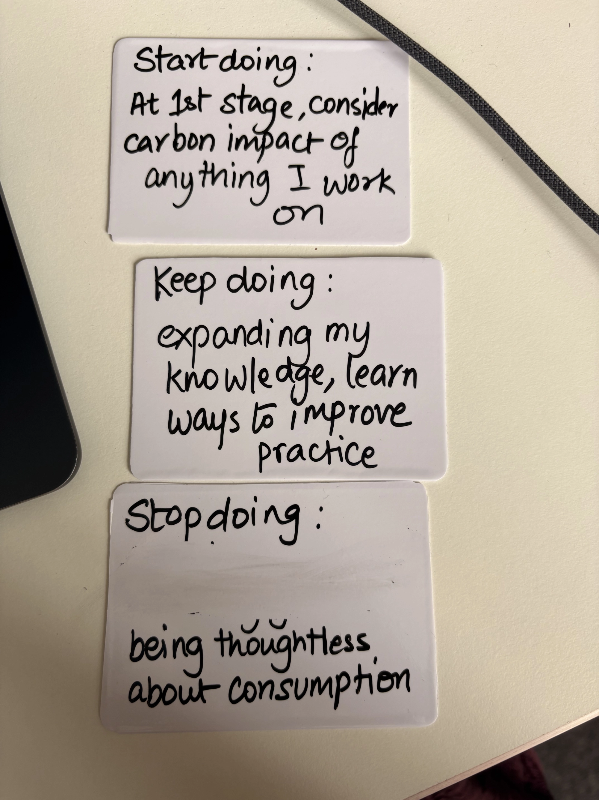
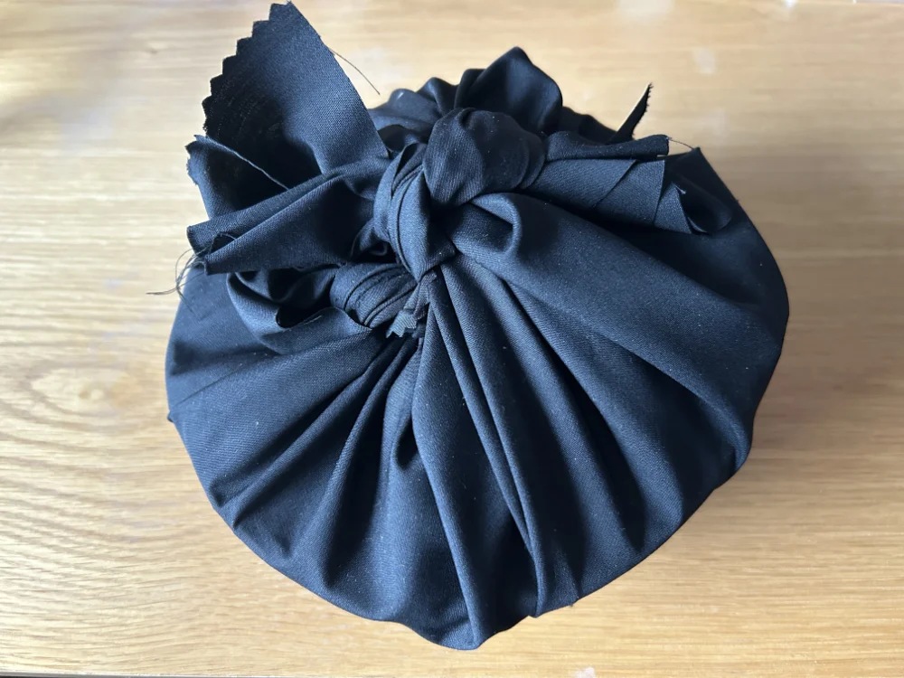
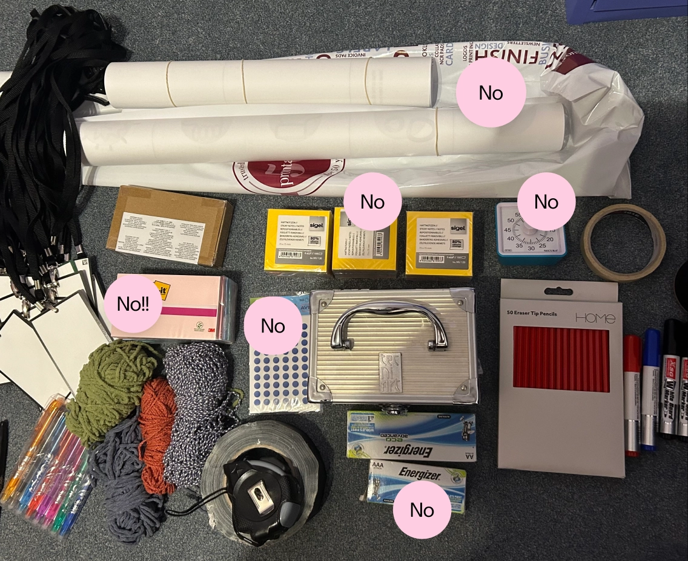
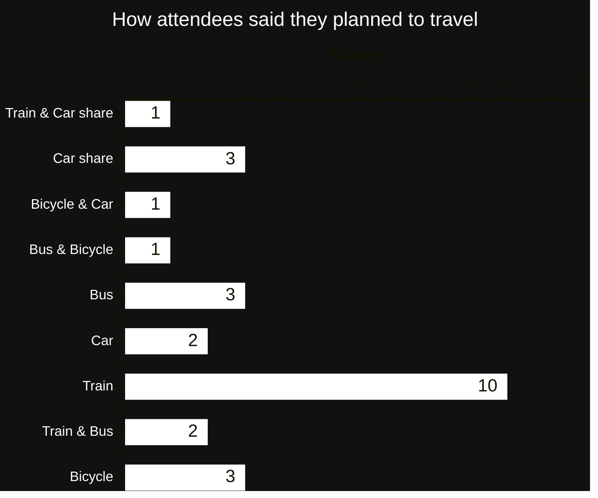

---
title: "Creating a sustainable workshop"
subtitle: "The thinking that went into Green Software Practitioner Study Day."
summary: "The thinking that went into Green Software Practitioner Study Day."
authors: []
tags: 
- "sustainability" 
- "blogging"
- "ai" 
categories: 
- "ux"
- "reflection"
- "practice"
date: 2026-01-04T12:00:00
lastmod: 
featured: false
draft: false 
toc: true

# Featured image
# To use, add an image named `featured.jpg/png` to your page's folder.
# Focal points: Smart, Center, TopLeft, Top, TopRight, Left, Right, BottomLeft, Bottom, BottomRight.
image:
  caption: ""
  focal_point: "Smart"
  preview_only: false

# Projects (optional).
#   Associate this post with one or more of your projects.
#   Simply enter your project's folder or file name without extension.
#   E.g. `projects = ["internal-project"]` references `content/project/deep-learning/index.md`.
#   Otherwise, set `projects = []`.
projects: [] 
--- 

The first Green Software Practitioner Study Day took place on 6th August 2025 at [Sussex Innovation Centre](https://www.sussexinnovation.co.uk/). 

As we have two further Study Days taking place in 2026 ([30th Jan - tickets on sale now](https://buytickets.at/ladiesthatuxbrighton/1971502), 13th March - tickets coming soon), I thought I'd reflect on what make the first one great. 

Personally, it isn't a stretch to say that designing and collaborating on the Study Day felt like a career defining moment for me. It has kicked off a professional side quest to support and build sustainable product teams - an idea seeded during [Silicon Brighton's EVOLVE [25] conference](/content/events/evolve25/). 

 

<em>The beauty of being the event facilitator meant that I had added motivation to finish my certification back in July. Then figure out the best flow for the day in August, based on my own experience!</em>

## The background 

The idea for the event came to me during a [Green Software Brighton](https://greensoftwarebrighton.co.uk/) meetup evening. Folks at the event mentioned completing the Green Software Foundation and The Linux Foundation's *Green Software Practitioner certificate* which is a free self-study course available on the [Green Software Foundation's website](https://movement.greensoftware.foundation/spaces/19525645/page). 

I too wanted to complete the certificate, but I found myself wondering if others encountered the same issues I did when it comes to self-paced online learning... 
- **Time**: the motivation was there, but as a small business owner the time wasn't. 
- **Relevance**: in tech, to paraphrase John Donne, no one is an island–we are part of interdisciplinary teams. It seemed to me that the power of this learning could only be unlocked through collaboration. 
- **Momentum**: in my previous work as a strategic designer, I knew that driving sustainability and behavioural change needs many champions to gain traction. From my own perspective as a contractor, I needed other folks' stories of success to help understand what more I could be doing. 
- **Journeys**: I wanted to know that I wasn't alone and that others were also encountering the same barriers that I was. We are on this journey together! 

I felt that all of the above, called for an in-person experience, by tech folks for tech folks. Where the time was reserved and structured to allow for the completion of the certificate alongside interdisciplinary disucssion. So, I set about creating an interest page as an experiment, to find out if others might like a dedicated 'Study Day' too. 

### Who attended

I thought that I would get maybe 12 people to attend. To my surprise, we sold out at 27 tickets with a healthy waiting list. We were also awarded a grant from Brighton & Hove Buses to help defray the costs of the event and provide some free spaces for students and those on limited incomes. A range of disciplines were represented across the 27 attendees including, developers, engineers, testers, consultants, accessibility specialists, product designers, product managers, UXers, founders, cloud architects, students, and recent graduates. 

What an attendee said:
> …being able to be in a friendly location with a group of people interested in the same subject matter especially was incredibly, encouraging and helped a lot…I would've otherwise just spoke about it for ages but not actually managed to execute. 

## The results 

Here are just a few of the stories of success from those who attended the event. Its always cool to hear what to learn what people took with them and *did* next!

- One person was able to use their learning on the Study Day to justify keeping older hardware runnning and to support donation and recycling initiatives for retired hardware. 
- I was able to support the sustainability aspects of a sucessful [Innovate UK](https://www.ukri.org/councils/innovate-uk/) grant application for a client. 
- Another organisation brought their whole team to the event. This decision to invest in a benchmark of knowledge across a team is such a powerful action to drive progress!  

## The design of the day 

I'll not go into too much depth on this, because it this is my 'secret sauce' as a learning-centric designer. However, it was important to me that the content shouldn't feel too rushed and the learning should be made more effective by immediately being applied and sythesised through interdisciplinary conversations. These conversations were constructively aligned with the topics we covered. Sharing experiences, asking questions, observations, and critique were actively prompted and encouraged. 

The collaboration between [LTUX Brighton](https://ladiesthatux.com/brighton/) and [Green Software Brighton](https://greensoftwarebrighton.co.uk/) was crucial to the fabric of the day. LTUX Brighton came with the UX and product angles and Green Software Brighton, brought dev, backend, and DevOps perspectives.

To get a flavour, you can view the schedule for the next event on [30th January 2026, at Ticket Tailor](https://buytickets.at/ladiesthatuxbrighton/1971502)(and ahem... sign-up). 

## The meta design of the day

Based on [BSI Flex 3030](https://www.bsigroup.com/en-GB/insights-and-media/insights/brochures/bsi-flex-30302024-net-zero-transition-plans-code-of-practice/), here are considerations I brought to the design of the event to minimise direct and indirect energy use. 

### Scope 1 emissions 
Based on the Greenhouse Gas (GHG) protocols these are emissions from direct combustion of fossil fuels (including petrol and other road fuels). As attendees and collaborators at the event fall into Scope 3, I'll focus on my own travel here. 

| Activity description  | Estimated CO2 | 
|---|---|---|
|  I walked to and from Brighton station with my trolley carrying materials.  | - | 
|  Return train journey from Brighton to Falmer |  0.42kg* |
|  I walked to and from Sussex Innovation Centre. | - | 

*11.909146km round trip at 0.035kg CO2/km, based on <a href="https://www.gov.uk/government/publications/greenhouse-gas-reporting-conversion-factors-2023">gov.uk 2023 conversion factors</a>.
 

----

My estimate for the same return journey by car is 1.2kg CO2, so by taking the train I've emitted between 65-67% less CO2. 

> [!NOTE]
> Okay, so far so good. I did originally intend to cycle, but I had too much to carry, so something to consider next time is can I carry less? The next venue, [WRAP](https://wrap.space/) is within walking distance, so that will help!

### Scope 2 emissions 
Scope 2 emissions (electricity, heat, cooling, steam) and is calculated based on location. 

#### WRAP
My preparation for the Study Day was completed at WRAP workspace next to Brighton station. Although I don't know their electricity and cooling emissions (it was July/August). I can point to their ethos with regards to recyling and waste management, the comparative newness of their building conversion, and their work with local infrastructure companies, such as [Brighton fibre](https://www.brightonfibre.com/). Check out a quick overview of their approach on [the WRAP website](https://wrap.space/aboutuswrap). 

#### Sussex Innovation Centre
The Study Day took place at Sussex Innovation Centre, again I don't know their electricity and cooling emissions. However, their support for sustainable businesses and research are second to none locally. For example, the [Environmental Sustainability Cluster](https://www.sussexinnovation.co.uk/who-we-support/environmental-sustainability-cluster/). Also, the University of Sussex is known for its approach to sustainability as outlined in their Susssex 2035 Creating Progressive Futures strategy ([strategy PDF](https://www.sussex.ac.uk/webteam/gateway/file.php?name=uos-11871-sussex-2035-strategy.pdf&site=689)). In related news, Dr Caroline Lucas, former MP and leader of the Green Party, has been appointed as [new Professor of Practice](https://www.sussex.ac.uk/broadcast/read/69442) as part of the new [Sussex School of Progressive Futures](https://www.sussex.ac.uk/strategy/index). 

#### Energy use in the room

In terms of active energy use in the room itself, there were 28 laptops and tablets running from active power supplies. We also had an LED monitor in the room, which turned off when it wasn't actively being used. 

To put this into perspective, if we had been on an online video call for the day the impact would have been far greater as most attendees were based within 50 miles of the venue. Strictly speaking emissions from a video call would then fall into scope 3 as the emissions would be disributed across the various attendee locations on their own computers, on their own broadband networks, on their own power supplies. 

This is especially pertinent when we consider that video calling platforms, love to encourage us to use high definition video! 

 

I did not turn this option on in Google Meet, as I far prefer the 'Joan Crawford' style filter that lower quality video provides - better for my skin and for the environment. I keep having to routinely dismiss this message–Google are quite insistent.
 

Granted not everyone would keep their video on for the whole day, but just as a 'back of a napkin' calculation... 
- If you had a high-definition video call that lasted 6 hours that would be 3.3kg of CO2 for one person* 
- 3.3kg X 28 people, including me as the presenter = 92.4kg 
- Added to that you have the laptops being powered at their respective locations which may have different power supply mixes (fossil fuels versus sustainable). Check out [electricity maps](https://app.electricitymaps.com/map/72h/hourly) for cool visualisations of supply mixes across the world. 

Had the majority of participants been travelling from further away then the impact would have been comparable. However, these figures certainly give me pause for thought and I will reduce my use of video during online calls going forward. 

*figures from Purdue University are <a href="https://www.sciencedirect.com/science/article/abs/pii/S0921344920307072?via%3Dihub">trapped behind a journal paywall</a>, so I have worked with <a href="https://gerrymcgovern.com/the-hidden-pollution-cost-of-online-meetings/">Gerry McGovern's estimates from 2020</a>.
 

> [!NOTE] 
> Hmmm, a bit light on some of the detail in this section. Something to work on with venues going forward. 

### Scope 3 emissions 
These are the indirect emissions that come from the goods and services purchased (upstream), the transportation of people and goods (e.g., transportation of the people attending), the use of good/services, and any other indirect GHG emissions. 

#### Goods and services purchased 

#### Good/Materials 
This is where I tried my best to reuse and not to buy new. The three exceptions being a roll of sticky-backed whiteboard plastic, fine tipped dry erase pens, and a corner cutter (all from Amazon, more on this below). I used the sticky-backed whiteboard plastic and the corner cutter with some blank playing cards I already had to create mini reusable whiteboards. 

I've been a fan of using playing cards rather than sticky notes for a while. This is because they feel less fixed and don't have glue on the back and can therefore be recycled more easily ([John V Willshire](https://smithery.com/about/), had the same idea with his [ArtEFact cards](https://artefactshop.com/)). However, I thought, what if I could make them reusable forever? Having handmade an initial batch of around 80 cards with the help of my Mum and partner, they have since become a staple of my workshops. So much so that I intend to create some in different colours taking inspiration from sticky notes and ArtEFact cards! 

Rather than a conventional ice breaker exercise I used objects as a way of getting attendees to think about their intentions for the day. All of these materials were found and recycled. I'm not going to tell you what exactly was wrapped up in these bundles, as shown below, because again 'secret sauce'™️. This use of objects was inspired by [Jules Gilleland's](https://www.thinkwiththings.com/) keynote presentation at [Playful Learning 25](https://playfullearningassoc.co.uk/pl25-keynotes/) conference, University of Sussex. 

 

Central to my ethos for this event was banning certain single use and plastic based materials in my workshop kit as outlined below. 

- No more sticky notes - only wipeable index cards and mini whiteboards going forward! 
- No more largescale prints or single use paper roles. Only reusable placemats! 
- No more plastic things that require batteries (e.g. my timer clock, when I next upgrade my slide remote this will also be front of mind). 

First time caller, Pauline (45) from Royston Vasey asks: 
> But, what about the pens? 

Alas, that is one thing I haven't been able to find a sustainable and durable solution to. I did try wax pencils out as an alternative to dry erase markers and they were too difficult to write with as they require a lot of pressure and then were too difficult to clean off.

#### Catering and Snacks 

For catering, we worked with fantastic chef, Oli Thompsett who is based at Sussex Innovation Centre. Oli created a marvellous vegetarian and vegan lunch for us based on seasonal ingredients and local produce. It truly was phenomenal and the nominal leftovers were boxed up, so there was no waste. Making sure we have a hearty and sustainable lunch will be a mainstay of every Study Day to come! Sharing a lunchtime chat is integral to the experience. 

On the snacks side these were my domain. With this I avoided single portion packaging, prefering to go with larger bags which can be provided in reusable bowls. I also opted for healthier options such as lentil chips, tortilla chips, and dried fruit. Cans and, where possible, glass bottled drinks were provided and leftover drinks were used for next LTUX Brighton event. 

#### Transportation of Goods 
As noted, food was sourced locally and snacks and materials were transported to the venue on my trusty trolley! 

Going back to my Amazon purchases, when I looked into where items actually ship from, two of my orders shipped from China. Even though I initially thought the were UK or EU based vendors. So, my new goal is to look for similar materials at local stationary shops to try to keep supporting the local economy. 

#### Transportation of people 
Attendees were encouraged to travel by public transport and were given a range of options, including the local [Beryl electric bikes](https://beryl.cc/scheme/brighton-and-hove). There is a stop for these on University of Sussex campus. 

In the end the stats for travel were: 

 

> [!Note]
> So a few car trips there, but in cases where this was combined with public transport, so making for shorter journeys. Hurray for the people who sorted out a car share!

#### Use of goods/services 
One area to improve upon was waste management in the room, to make it easier for attendees to deposit compostable items. For instance, I provided vegware cups so that we could have some drinks in larger bottles. However, disposing of them meant a big collection effort at the end of the day. Attendees were also encouraged to bring their own water bottles and reusable coffee cups for use throughout the day. 

**This is where I'll touch on our use of third-party IT tools.** So at LTUX Brighton, we recently used our [Privacy Policy](https://ladiesthatux.notion.site/privacy) as an opptunity to ethically review the digital tools we are using. This was very much instigated by this event and [Talk UX conference](/content/events/talkux/index.md). We decided to use Ticket Tailor due to their ethical ticketing ethos and UK-based operations, although would still like to see some clearer infomration about their climate commitments. Take a look at the [Privacy Policy Appendix](https://ladiesthatux.notion.site/privacy#2dd95f4acd8f42eb971eb3929ef6b3a9) to see a list of the tools LTUX Brighton use and why. 

### What about the Green Software Principles? 

I've outlined the principles below and they didn't apply to the event design, aside from my goal to consume as little energy as possible. 

Something, that I will be bringing into the next event are the [Green Software Patterns for AI by Navveen Balani](https://patterns.greensoftware.foundation/catalog/ai/) at the Green Software Foundation. I am actively applying these principles through advice I provide as a consultant. 

I'll also point to the superb, [W3C Web Sustainability Guidelines](https://www.w3.org/TR/web-sustainability-guidelines/), lead edited by local web hero [Alexander Dawson](https://alexanderdawson.com/), and released in late 2025. These guidelines could be the basis of several more specialist Study Days (watch this space!). 

[**Green Software Principles**](https://learn.greensoftware.foundation/introduction/)

- **Energy Efficiency** 
"Consume the least amount of electricity possible." 

- **Hardware Efficiency** 
"Use the least amount of embodied carbon possible." 

- **Carbon Awareness** 
"Do more when the electricity is clean and less when it's dirty." 

## That's a wrap, or is it? 

Yes, that is a terrible pun because our next event *is* at WRAP. However, it wasn't 'a wrap' for my sustainability focused thinking and I then went right into the sustainable design of the [Talk UX conference](/content/events/talkux/index.md). In fact, I combined it that very day when I visited someone else at University of Sussex to look at some of their materials that I could recycle and reuse. 

## Will we see you at the next Green Software Practitioner Study Day?

Please join us at a future event and if you have any questions please get in touch with me at [brightonladiesthatux(at)gmail.com](mailto:brightonladiesthatux@gmail.com) or via [LinkedIn](https://www.linkedin.com/in/fionamacneill). 

*Special thanks to Deeksha Bhushan who took many of the wonderful photos recording our activities during the Study Day.* 