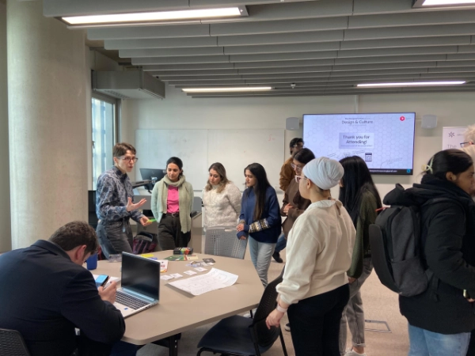
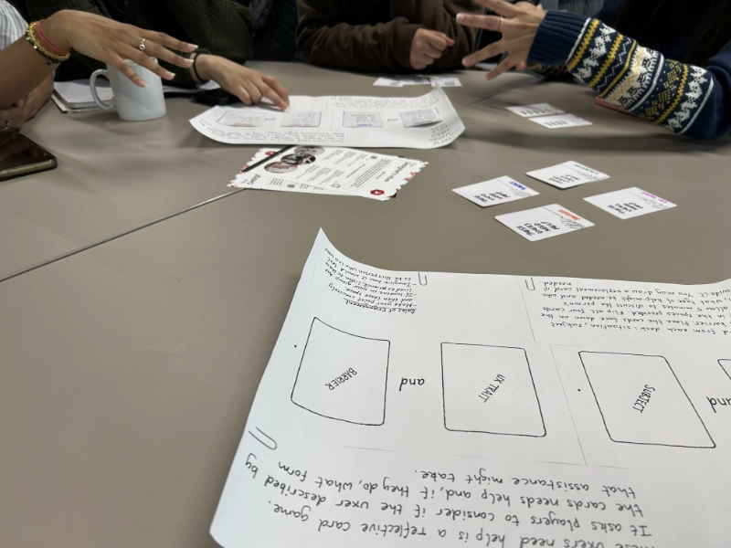

Student sociey run led by Jennifer Udenze, Kirti Kumar, and Jordan Rocha. This was a great day and it was superb to be invited to play reflective gam, '[These UXers Need Help](https://www.fionamacneill.co.uk/post/2023/07/these-uxers-need-help-version-2.0/)'. During the day I showed a range of design focused cards, including [Smithery's Regenerative Design Field Kit](https://artefactshop.com/products/regenerative-design-field-kit). 

 
<caption><em>Showing Smithery's Regenerative Design Toolkit as an example of a design game to a group of students</em></caption> 

