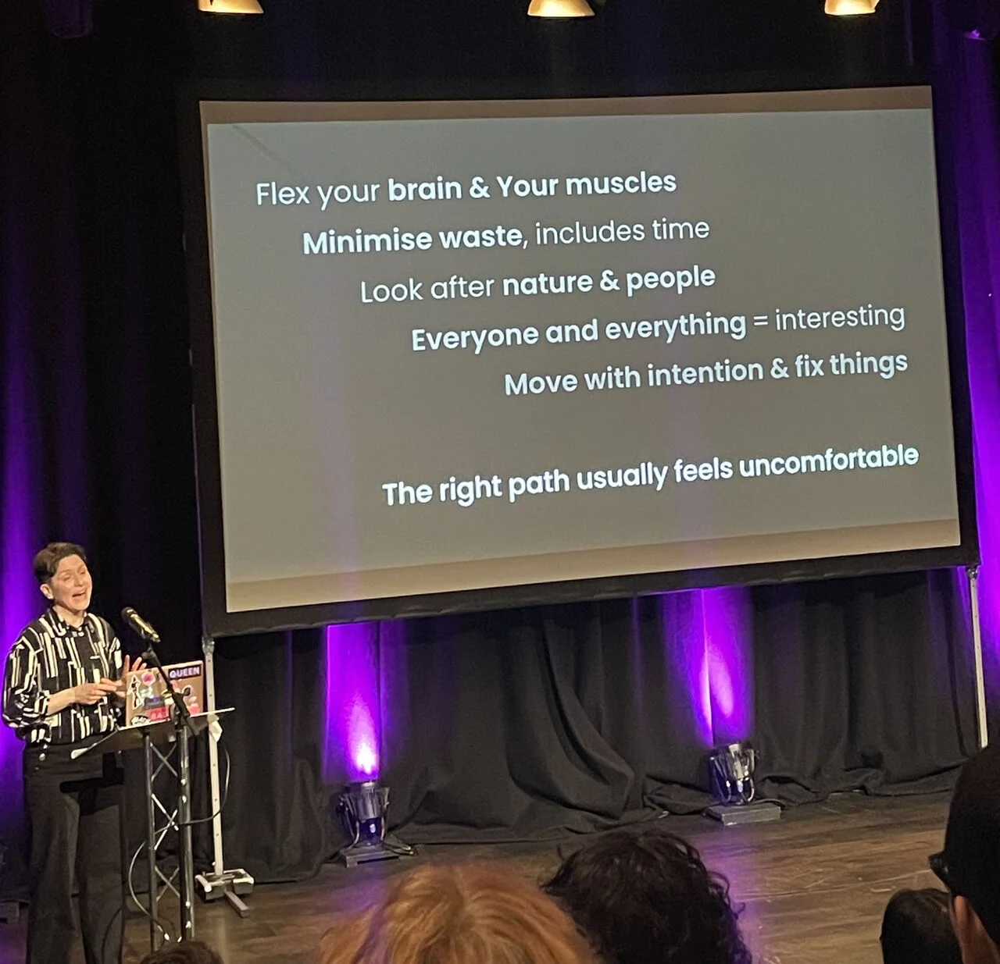

I was honoured to be invited to talk at SheSays Brighton for International Women's Day 2026.

*Photo by Harmony Kinnear, used with permission.* 

> [!NOTE]
> <strong>Text shown on the slide above:</strong>   Flex your brain & your muscles.  Minimise waste, includes time.  Look after nature & people.  Everyone and everything = interesting.  Move with intention & fix things.  The right path ususally feels uncomfortable. 
