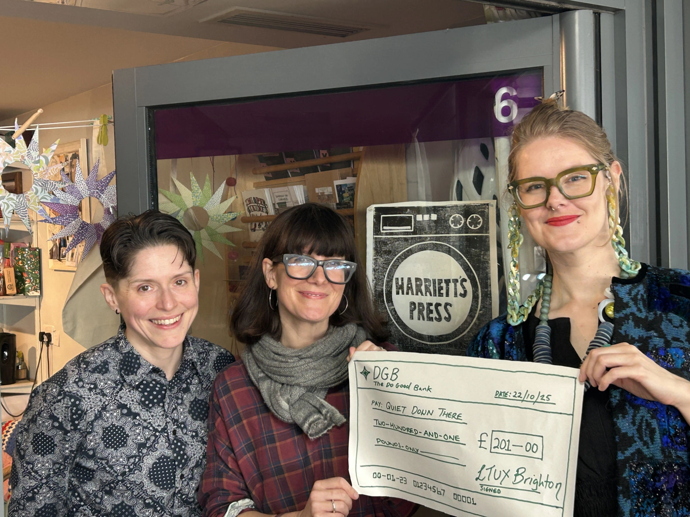

In 2025, LTUX Brighton hosted the international conference for [Ladies that UX](https://ladiesthatux.com/), [Talk UX](https://www.talk-ux.com/). 

## Talk UX Stats 

- 188 attendees over 2 days | 151 in-person and 37 online 
- 20 talks 
- 5 workshops 
- 3 short film screenings 
- 1 panel discussion 
- £201 raised for local charity, [Quiet Down There](https://quietdownthere.co.uk/).

## Personal Reflection 

Personally, Talk UX was one of the most challenging, yet fulfilling experiences of my life. It really warrants it's own blog post, particularly because we tried to make the event as responsible and sustainable as we could. As organisers we considered this in terms of how we organised, resourcing (both in-person and digital), and environmental impact. 

I grew both in so many ways as a person, as a designer, as a leader, and as a business leader through the experience. I will be forever thankful for the vision, belief, and trust or our organising group and everything we achieved together. 

This marked the end of my chapter leadership of LTUX Brighton. I'm staying on as treasurer as we move into next phase of our development as a group.  

 

*Photo by Laura Rodriguez*  
**Left-to-right:** Inka Howorth, Fiona MacNeill, Heidi Swigon, Lou Carroll, Alex Woodward, Emily Clark, Deeksha Bhushan, Alice Umeji. 

 

**A huge thank you to Quiet Down There for their collaboration. Although we were only able to make a small donation this time, we hope to be able to do more in the future. Our goal was to help raise awareness about the amazing work they do to address hygiene poverty and we successfully did that with Talk UX and through our social media posts.  