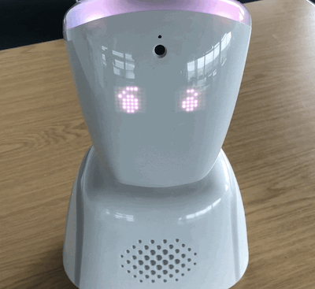

From January until May 2019 the eLearning team evaluated the AV1 robot avatar, a telepresence robot manufactured by the company _No Isolation_, based in Norway. This post aims to provide a brief overview of what we learned during our pilot project.

Our findings are shared with the caveat that they are specific to our institution and in different circumstances the end-user acceptance of the technology and the results may have varied.

## About the pilot
This pilot project was designed to establish the functionality of a telepresence robot, the AV1, with a view to providing a bookable service for eligible students in the future. The AV1 robot's purpose is to provide an avatar for an individual student who wishes to attend a class but may not be able to be present in-person. Such a student, due to circumstances including, but not limited to, medical conditions, learning disabilities or caring responsibilities could benefit from attending _virtually_ from home or in an alternative location. The AV1 robot provided a different type of value proposition when compared to existing solutions such as video conferencing; it provided an individual, encrypted connection to the classroom for a single student user.

The aim of this pilot project in the first instance was to establish the functionality and usability of the AV1 robot device. We planned to do this by inviting students from a specific school to participate in testing the robot during a class session. These students were invited irrespective of need as it was not possible to target a specific student population, for instance those with learning support plans. We had hopes that having established the functionality of the robot we could progress to a second phase of the project. This second phase would be in collaboration with colleagues who work to support students directly so that we could make the technology accessible to those students who need it.

### How does the telepresence robot work?
The robot unit is positioned in the classroom for the student and then the student uses a phone or tablet to control the robot’s line of sight and display facial expressions on the robot's face from afar. The phone/tablet can also be used to ask the instructor questions and to access the video stream. For the privacy of other students, any recording facilities on the smartphone/tablet are disabled. The video stream therefore is also time-specific, just as it would be for in-person attendance at a lecture. The robot also allows for a level of anonymity if desired, so the student can choose to silently observe and attend the lecture or seminar without calling attention to their absence or revealing their identity.

We created[^1] this video to provide a quick description for student of how the robot works...
<iframe src="https://www.youtube.com/embed/LspNgSY2WYM" width="560" height="315" frameborder="0" allowfullscreen="allowfullscreen"></iframe>

### Aims for the pilot project
We have provided some information about the proposed <a href="#rm">research methods</a> at the bottom of this post. The aims listed below are provided with an indication of how successful we were at achieving each.

> <h4><strong>Aim #1</strong></h4>
To establish the utility of the device in lecture and seminar settings.
<h4 style="padding-left: 40px;"><strong>Aim #1 - Result</strong></h4>

We were able to test the robot in two seminars sessions through technical staff use (no use by students). We did not use it in a lecture setting due to scheduling.

> <h4><strong>Aim #2</strong></h4>
To build expertise in Information Services, as such devices may be recommended as assistive technologies for students in the near future. It is important to establish the telepresence robot’s function and how to accommodate such devices on the wireless network.
<h4 style="padding-left: 40px;"><strong>Aim #2 - Result</strong></h4>

We were successful in this area, both the eLearning team and our colleagues in network services learned about how the robot worked on our network.

> <h4><strong>Aim #3
</strong></h4>
To understand the student experience of using the telepresence robot from a location beyond the classroom.
<h4 style="padding-left: 40px;"><strong>Aim #3 - Result</strong></h4>

We were unsuccessful. The robot was demonstrated to two different groups of students in different year groups and the pilot project failed to recruit.

> <h4><strong>Aim #4</strong></h4>
To establish the telepresence robot’s suitability to potential requirements and understand the limitations of the technology.
<h4 style="padding-left: 40px;"><strong>Aim #4 - Result</strong></h4>

We were successful in learning about some of the requirements and also understanding the limitations of the technology in our particular setting.

> <h4><strong>Aim #5</strong></h4>
To understand how the presence of the robot affects the taught environment, including the experiences of academic staff who teach with such a device present in-place of a student.
<h4 style="padding-left: 40px;"><strong>Aim #5 - Result</strong></h4>

We were unsuccessful in this venture as we were not able to test the robot in situ without the presence of a technical staff person in a naturalistic way due to not having student participants.

### What actually happened?
While we sought ethical approval for user testing, the robot went on a little roadshow to meet members of staff. It was introduced at one of our regular 'All things eLearning' tech afternoons and was enthusiastically received by staff. The robot was also taken to meet the university's disabilities and dyslexia team, who were interested in how the technology could be used to support students. During this time the robot was tested in a few locations at the university's Falmer and Moulsecoomb campuses. Colleagues in network services also spent some time testing the robot to establish the network load of the streaming video functions. Everything seemed hunky dory and ready to go.

After ethical approval was gained. A small number of willing academic staff were recruited, and the robot was taken to visit two separate classes by a member of the eLearning team. These class visits were put in place to demonstrate the robot's capabilities, to explain the aims of the project and to allow for recruitment of student participants by a neutral third-party[^2] This is where our story takes a downturn.

During the first class visit we discovered some limitations related to connectivity. The AV1 can automatically assess the available network connections and choose the best connection based on signal strength. This is a helpful trait, but we encountered an issue where the robot routinely dropped off eduroam. We would have liked to be able to enforce which signal the robot selected, but we had no control of this setting. As a result, the reliable little robot failed spectacularly when confronted with the 4G connection in the South Downs National Park where the Falmer Campus is based[^3]. There is an assistant app which allows for a level of technical oversight, but the controls were too basic for our needs and did not include any diagnostic functions. Alas, the robot did not give a good first impression through a combination of circumstances. _No Isolation_ were great at working with us to resolve the Wi-Fi issues and willingly took onboard feedback related to the robot control apps. Another class visit was arranged.

During the second class visit the robot was demonstrated successfully, but the video stream was very poor quality as the signal once again reverted to 4G having been on WIFI successfully earlier in the day. Other devices in the room were connected to WIFI. What was different about this visit is that the students were not keen on the robot and their response to its presence seemed to imply an air of 'uncanny valley'[^4]. They didn't want the camera to look in their direction and there was a feeling of unease in the room.

## Personal reflection from project lead
There are a variety of factors that led to the early cancellation of this project, but the main reason was lack of student study participants. To reflect, this could have been due to the time of term and the proximity to assessments. Another point is that as the main researcher on the project, perhaps I did not articulate the value of the tests adequately. I also could not pay students or offer them any incentives for participation beyond helping other students; for time-strapped students with many competing demands this may not have been enough. If the project had been working with a small focus group of students in different settings, that could have worked better, particularly if those students were in need of such a solution. However, such a venture would require a different group of stakeholders than we had for this basic pilot.

From a technical standpoint I felt that the staff overhead was too high to be sustainable. On a logistical level we would need a person to take the robot to the correct building and lecture/seminar room at the correct time and to then coordinate with the student user to ensure that they were able to connect. Furthermore, the assistant app for remote support of the robot was not yet sophisticated enough to meet our needs in terms of providing diagnostic information about the robot and its connectivity.

In our proposed service model, the robot would belong to the university and could be borrowed; based on testing the robot is not really designed for that type of deployment. In reality the robot really has a one-to-one relationship with the student, and it is not easy to reset it for use with a new mobile device without contacting support and requesting a new activation code. For instance, it would not be possible to have a service where a student could call/email our help desk and request a telepresence robot for their session in the afternoon, as their phone/tablet needs to be coupled to the robot. That is not something that we could do easily on an ad hoc basis from afar and it would then need to be reset again to allow the next student borrower. The ideal use model is that the robot _is _a representative of an individual student in the classroom, which is fine, but implies that the student also owns the equipment themselves. In our HE context, it may be that students would not need such a service for all their lectures, but for example only on particular days where they might have had a flare-up of a health condition. So, in our borrowing model, we would have to provide an iPad to _couple-with_ the robot and that iPad would have to stay with the student for as long as they used it.

Following on from the point above, I believe that a borrowing model could work in HE for planned leave such as, maternity/paternity, medical and personal. Maternity leave has already been explored by a pilot project at the University of Oxford (European Bioinformatics Institute, 2018). In these cases, it would be possible for a student to pick up the robot's accompanying iPad prior to going on leave and then keep the iPad for the duration of their leave, so that they could attend classes. This also implies that there would be a need for more than one robot and for there to be means-tested or referral-based eligibility criteria. Without considerable service planning, it would be easy to see that such a service might be underutilised in the reality of a busy HE setting.

## Verdict
There is certainly potential for a future service provision, but more sophisticated management tools are needed for HE settings. Anecdotally speaking, the reaction of some students to the aesthetic design of the robot suggests that a different approach may be needed for the device to feel appropriate for adult learners.

## References

Gibbs, G. (1988) _Learning by doing: A guide to teaching and learning methods_. Further Education Unit. Oxford Polytechnic: Oxford.

European Bioinformatics Institute (2018) _Meet the robot avatars helping Cambridge students combine education and motherhood_. <a href="https://www.cam.ac.uk/research/news/meet-the-robot-avatars-helping-cambridge-students-combine-education-and-motherhood">https://www.cam.ac.uk/research/news/meet-the-robot-avatars-helping-cambridge-students-combine-education-and-motherhood</a> (Accessed: 24 October 2018).

No Isolation (2018) _The impact of AV1 on children with long-term illness and absence_. Available at: <a href="https://www.noisolation.com/global/research/the-impact-of-av1-on-children-with-long-term-illness-and-absence/">https://www.noisolation.com/global/research/the-impact-of-av1-on-children-with-long-term-illness-and-absence/</a> (Accessed: 24 October 2018).

Schrepp, M., Hinderks, A. and Thomaschewski, J. (2017) Design and evaluation of a short version of the User Experience Questionnaire (UEQ-S). _International Journal of Interactive Multimedia and Artificial Intelligence,_ 4(6), 103-108.

University of Edinburgh (2019) _Reflection toolkit_. Available at: <a href="https://www.ed.ac.uk/reflection/reflectors-toolkit/reflecting-on-experience/gibbs-reflective-cycle">https://www.ed.ac.uk/reflection/reflectors-toolkit/reflecting-on-experience/gibbs-reflective-cycle</a> (Accessed: 26 March 2019).

## Research methods
The following qualitative research methods were planned:
<ul>
 	<li>A testing session would be arranged during a scheduled class. The student would have attended remotely during the class and would have been asked to use the telepresence robot independently after receiving basic instruction.</li>
 	<li>The student would have been asked to complete a short questionnaire at the beginning of the session prior to use. A second version of the same questionnaire would have been repeated at the end of the testing session. The core questions are based on a validated user experience questionnaire (UEQ-S; Schrepp, Hinderks and Thomaschewski, 2017).</li>
 	<li>Anonymised typed notes would have been taken during the testing session to record any verbal feedback that the student tester wished to share with the researcher.</li>
 	<li>Academic staff participants would have been asked to complete a written reflection of a minimum one-page in length based on Gibbs’ Reflective Cycle (1988; see also University of Edinburgh, 2019).</li>
</ul>
The following quantitative research method were planned:
<ul>
 	<li>The bandwidth used by the telepresence robot during the testing sessions would have been monitored by the university's network services team.</li>
</ul>

## Addendum
[An article from the BBC (20/02/19)](https://www.bbc.co.uk/news/uk-scotland-edinburgh-east-fife-47305835) about parents' privacy concerns related to use of an AV1 robot in a classroom setting.

[^1]: we used [Powtoon](https://www.powtoon.com/home/?) to create the video.
[^2]: The member of the eLearning team who does not have an existing service-based relationship with students.
[^3]: quite a rural and hilly area].
[^4]: [Article about _uncanny valley_ from Wikipedia](https://en.wikipedia.org/wiki/Uncanny_valley).